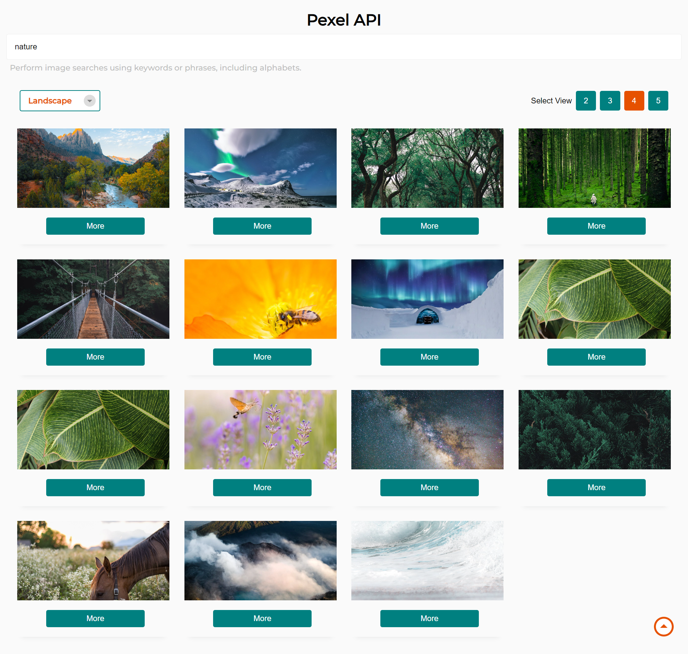
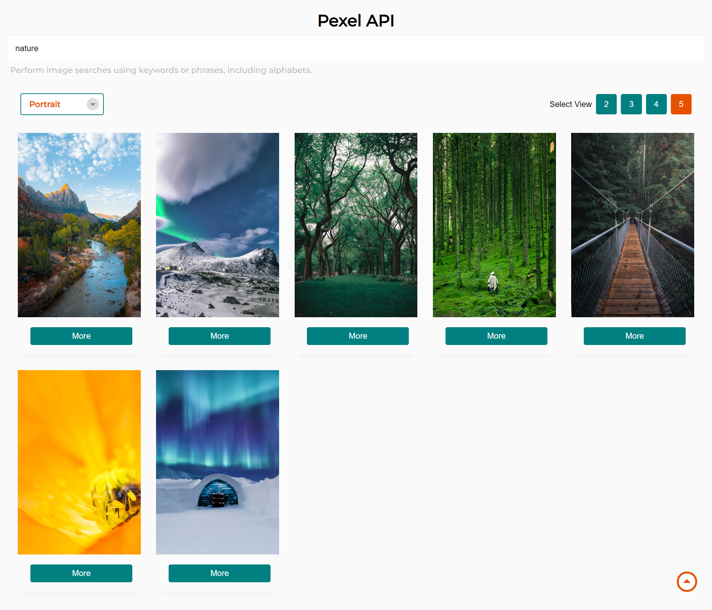
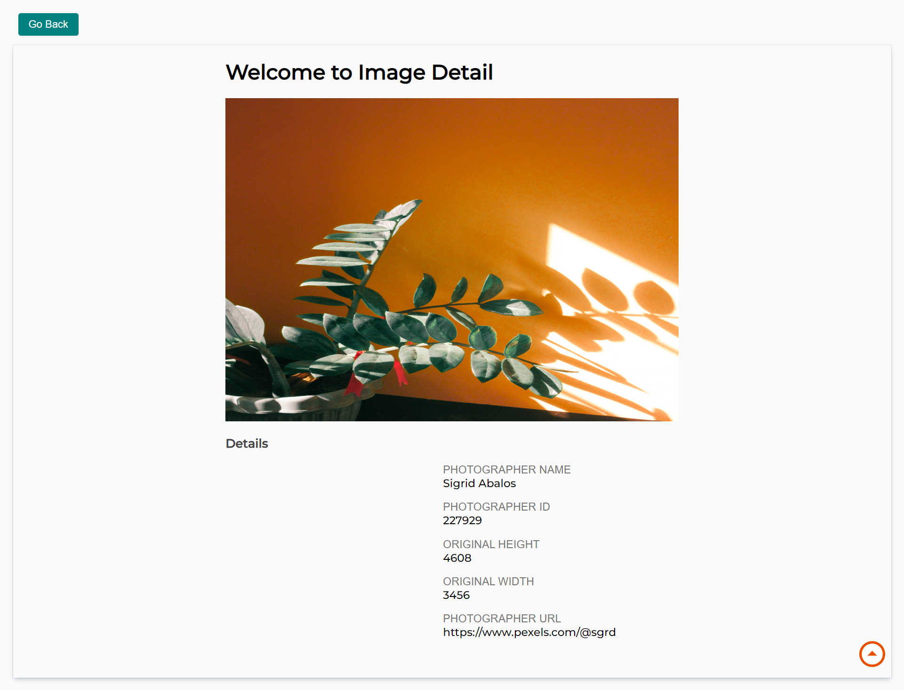

# **Efficient image search using Pexels API with debouncing for optimization.**

<h1>Details:</h1>
<p>The Pexels API search with debouncing, routing, Redux for state management, Axios for fetching, single image detail page, and useSearchParams combines powerful technologies for a seamless user experience. With debouncing, search results load efficiently, while routing ensures smooth navigation. Redux handles state management, Axios fetches data, and useSearchParams preserves state and URL queries. Explore stunning images and dive into detailed image information with this robust application.</p>

### _<u>Functionalities</u>_

1. Images on Homepage
2. Infinite Scroll
3. Perform a search either by <br/> pressing Enter or by searching  <br/> alphabetically without the need to press Enter (Debouncing).
4. useSearchParams to manipulate URL Query 
5. Ease in State Management using Redux, Redux-Thunk, Redux Toolkit
6. useParams to get previous Data
7. Individual Page
8. Bottom to Top Scroll Button
9. Change the Grid Layout 
10. Change the Image Orientation using Select Tag


<h1>Screenshots</h1>
<p>1. Landscape Orientation with Grid Size : 4</p>



<p>2. Landscape Orientation with Grid Size : 2</p>


<p>3. Portrait Orientation with Grid Size : 5</p>



<p>4. Search Result on typing "T" with Grid Size : 3 in Portrait orientation</p>


<p>5. Dynamic Individual Image with Details</p>




<h2>🛠️ Installation Steps:</h2>

<p>1. Clone the repo : VITE App</p>

```
git clone https://github.com/Sourav01112/Pexel_Search.git
```

<p>2. Install NPM package</p>

```
npm install
```

<p>3. Client will run at 127.0.0.1:5173</p>

```
npm run dev
```

  
## 🖥️ Tech Stack
**Frontend:**

&nbsp;
&nbsp;
&nbsp;
&nbsp;
&nbsp;
&nbsp;
&nbsp;
&nbsp;


<h2>Author : Sourav Chaudhary</h2>
